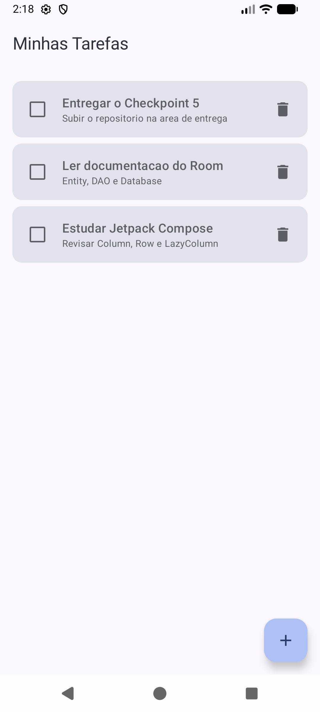
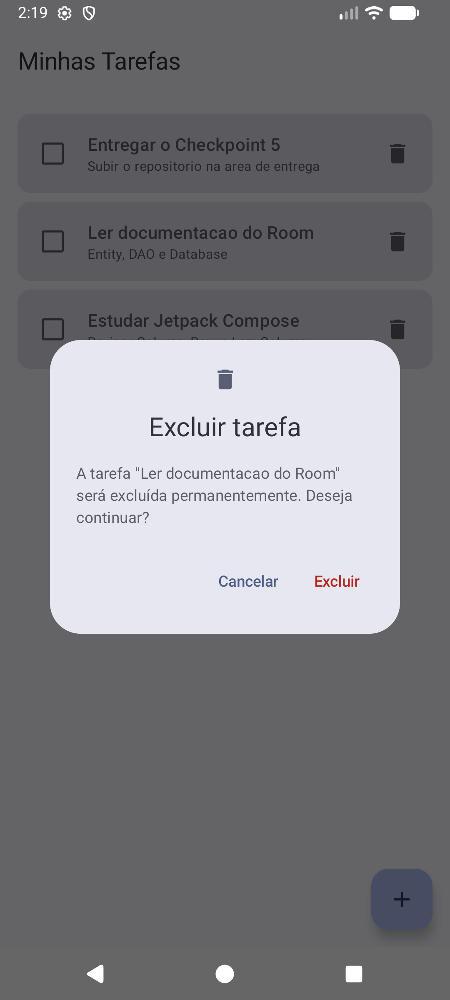
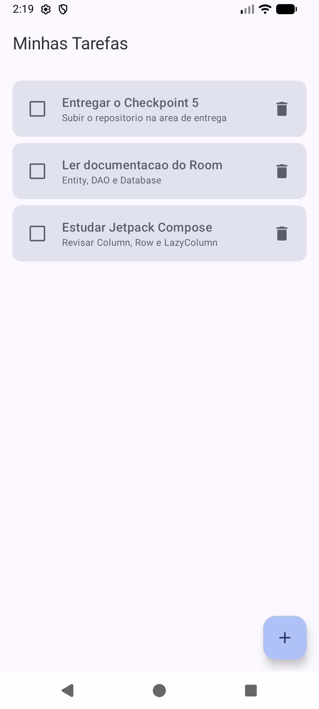
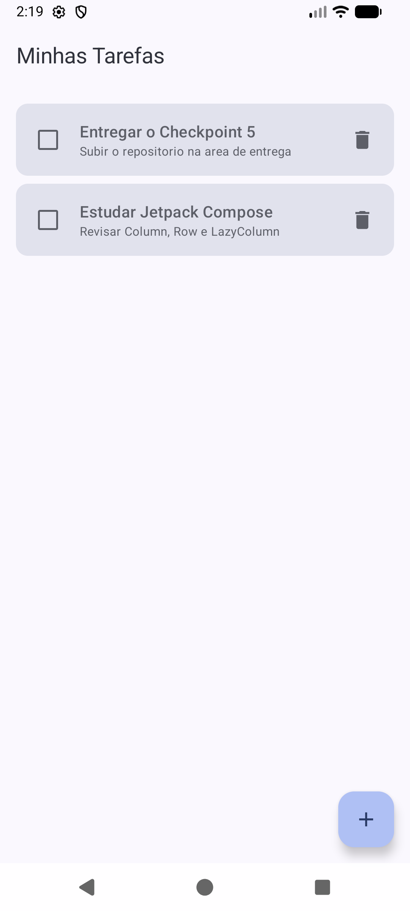

# Evidências — Confirmação de exclusão de tarefas

Prova prática: **Confirmação de exclusão de tarefas** — Android Kotlin Developer / FIAP.

Antes desta implementação, tocar no ícone de lixeira excluía a tarefa imediatamente.
Agora o toque abre um **diálogo de confirmação Material 3 sobre a própria tela da
lista** (nenhuma tela nova foi criada), informando qual tarefa será excluída e
oferecendo as ações **Cancelar** e **Excluir**.

## O que foi implementado

- `ConfirmarExclusaoDialog` — um `AlertDialog` do Material 3 com ícone, título
  "Excluir tarefa", o **título da tarefa selecionada** no corpo da mensagem, o botão
  **Cancelar** (fecha sem alterar a lista) e o botão **Excluir** (destacado com
  `colorScheme.error`).
- Em `ListaTarefasContent`, um estado `tarefaParaExcluir: Tarefa?` guarda **qual**
  tarefa aguarda confirmação. O ícone de lixeira apenas preenche esse estado; a
  exclusão de fato (`viewModel.deletar`) só acontece no clique em **Excluir**, o que
  garante que somente a tarefa selecionada seja removida.
- Duas novas `@Preview`: `ListaTarefasContentConfirmandoExclusaoPreview` (a lista com
  o diálogo aberto) e `ConfirmarExclusaoDialogPreview` (o diálogo isolado).
- A arquitetura MVVM e as funcionalidades anteriores — cadastro, edição, conclusão,
  prazos, ordenação e destaque de tarefas atrasadas — foram preservadas: o estado do
  diálogo é local da tela, e a operação de exclusão continua passando por
  `TarefaViewModel → TarefaRepository → TarefaDao`.

Arquivo alterado:
[`ListaTarefasScreen.kt`](app/src/main/java/rafaelvi/com/github/todolist/ui/ListaTarefasScreen.kt).

## Sequência de evidências

### 1. Lista antes da exclusão

Três tarefas cadastradas. Nenhum diálogo aberto.



### 2. Diálogo aberto com a tarefa selecionada

Após tocar na lixeira da tarefa **"Ler documentacao do Room"**, o diálogo é exibido
sobre a lista e cita o título dessa tarefa.



### 3. Resultado ao cancelar

Tocando em **Cancelar**, o diálogo fecha e a lista continua com as três tarefas —
nada foi excluído.



### 4. Nova abertura do diálogo

A lixeira da mesma tarefa é tocada novamente e o diálogo reaparece corretamente.


### 5. Resultado após confirmar a exclusão

Tocando em **Excluir**, o diálogo fecha e **apenas** a tarefa "Ler documentacao do
Room" é removida; as outras duas permanecem intactas.



## Como reproduzir

```bash
./gradlew installDebug
```

Com o app aberto, cadastre algumas tarefas, toque na lixeira de uma delas e teste as
ações **Cancelar** e **Excluir**.
