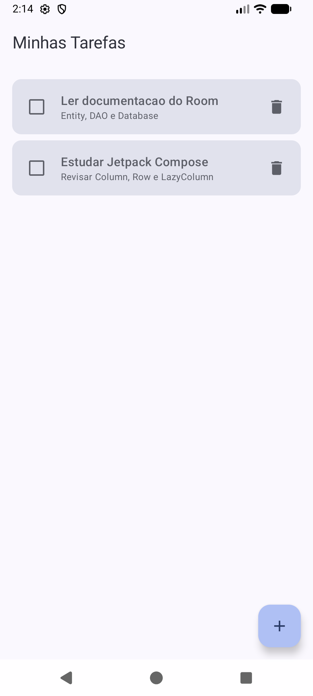
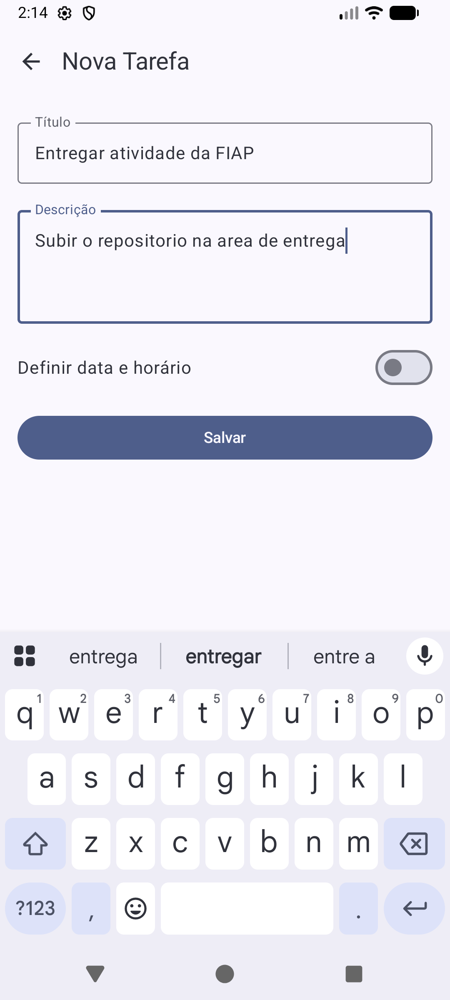
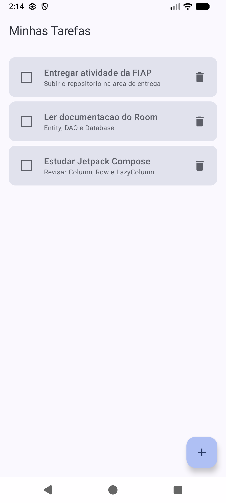
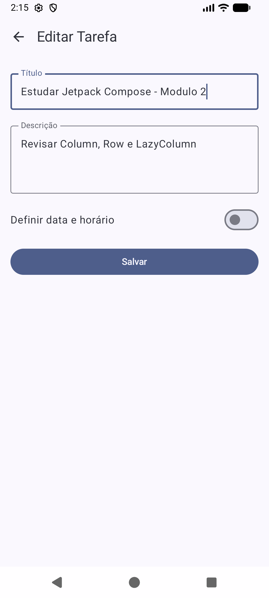
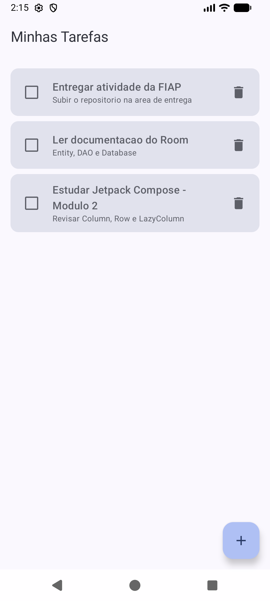
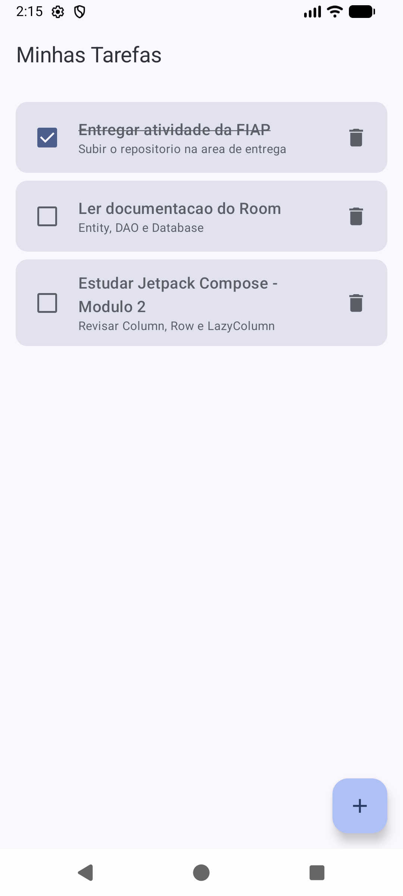
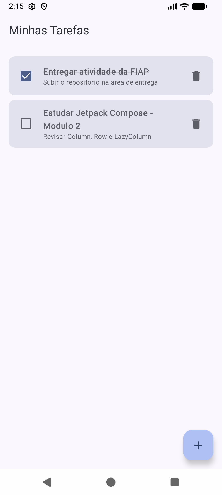
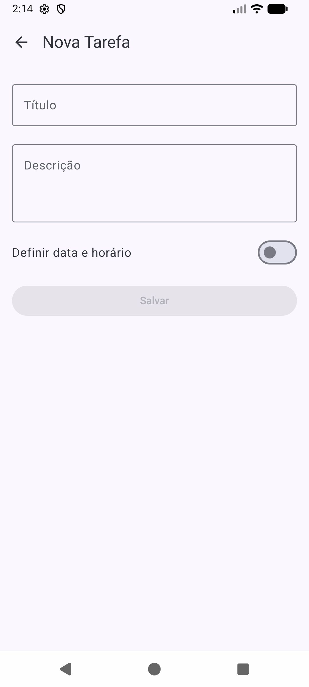
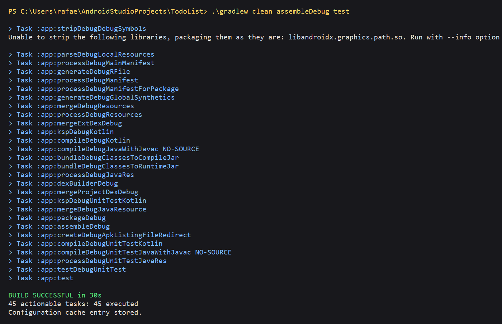

# To-Do List — FIAP


Aplicativo Android de lista de tarefas desenvolvido para a atividade individual de
**implementação da camada de UI, navegação e ViewModel do To-Do List**.

O objetivo da aplicação é permitir que o usuário organize suas tarefas do dia a dia:
cadastrar, listar, editar, definir um prazo, marcar como concluída e excluir — com os
dados persistidos localmente no aparelho, de modo que continuem disponíveis depois de
fechar o app.

## Funcionalidades

- Listar as tarefas cadastradas, ordenadas por prazo
- Cadastrar uma nova tarefa (título, descrição e, opcionalmente, data/horário)
- Editar uma tarefa já existente
- Marcar/desmarcar uma tarefa como concluída
- Excluir uma tarefa, com diálogo de confirmação antes da remoção definitiva
- Destaque visual para tarefas atrasadas (prazo vencido e ainda não concluídas)
- Persistência local com Room (SQLite)

## Tecnologias utilizadas

| Camada | Tecnologia |
|---|---|
| Linguagem | **Kotlin** |
| Interface | **Jetpack Compose** + Material 3 |
| Navegação | **Navigation Compose** |
| Persistência | **Room** (SQLite) |
| Assincronismo / estado | **Coroutines** e **Flow** / `StateFlow` |
| Apresentação | **ViewModel** (`androidx.lifecycle`) |
| Testes | JUnit (unitários) e AndroidJUnit4 (instrumentados) |

## Arquitetura

O projeto segue o padrão **MVVM**, sem framework de injeção de dependência — as
dependências são montadas manualmente por uma *Factory*, para deixar explícito o
caminho que o dado percorre.

```
app/src/main/java/rafaelvi/com/github/todolist/
├── data/          # Model     — Entity Tarefa, TarefaDao e TarefaDatabase (Room)
├── repository/    # Model     — TarefaRepository, fonte única de dados
├── viewmodel/     # ViewModel — TarefaViewModel, estado observável e operações
├── ui/            # View      — ListaTarefasScreen e FormularioTarefaScreen (Compose)
├── navigation/    # View      — AppNavigation, rotas do app
└── util/          # Funções puras de formatação/conversão de data e hora
```

Fluxo dos dados:

```
Room (TarefaDao)  →  TarefaRepository  →  TarefaViewModel  →  Telas Compose
 Flow<List<Tarefa>>        Flow              StateFlow         recomposição
```

### `TarefaRepository`

É a camada que **isola o acesso a dados do restante do aplicativo**. Ele recebe o
`TarefaDao` no construtor e expõe:

- `tarefas: Flow<List<Tarefa>>` — o fluxo contínuo com a lista atual do banco;
- `inserir`, `atualizar` e `deletar` — funções `suspend` que apenas delegam ao DAO.

A ViewModel nunca conversa diretamente com o Room: ela conhece somente o repositório.
Assim, se um dia a origem dos dados mudar (uma API, por exemplo), só o repositório
precisa ser alterado.

### `TarefaViewModel`

É a camada de apresentação. Ela:

- converte o `Flow` do repositório em um **`StateFlow` observável pela UI**, usando
  `stateIn(viewModelScope, SharingStarted.WhileSubscribed(5_000), emptyList())` — ou
  seja, o estado sobrevive a mudanças de configuração (como girar a tela) e deixa de
  ser coletado quando ninguém está observando;
- expõe `inserir(tarefa)`, `atualizar(tarefa)` e `deletar(tarefa)`, que disparam as
  operações suspensas dentro do `viewModelScope` (fora da main thread);
- traz uma `companion object { fun factory(context) }`, que monta a cadeia
  `TarefaDatabase → TarefaDao → TarefaRepository → TarefaViewModel`.

### `ListaTarefasScreen`

A tela de listagem observa o estado com
`val tarefas by viewModel.tarefas.collectAsStateWithLifecycle()`. Sempre que o banco
muda, o `StateFlow` emite uma nova lista e o Compose **recompõe apenas o necessário**.

A tela é dividida em duas partes, para manter as `@Preview` funcionando sem banco:

- `ListaTarefasScreen(viewModel, ...)` — conectada à ViewModel, traduz cada interação
  em uma ação: o `Checkbox` chama `viewModel.atualizar(tarefa.copy(concluida = ...))`
  e o ícone de lixeira chama `viewModel.deletar(tarefa)`;
- `ListaTarefasContent(tarefas, callbacks...)` — composable sem dependência de
  ViewModel, que só recebe dados e lambdas. É ele que aparece nos previews.

A lista é renderizada em um `LazyColumn` com `items(tarefas, key = { it.id })`; o
`FloatingActionButton` dispara `onNovaTarefa()` e tocar no card dispara
`onEditarTarefa(tarefa.id)`.

### `FormularioTarefaScreen`

O mesmo formulário atende **cadastro e edição**, e a diferença é o `tarefaId` recebido
pela navegação:

- `tarefaId == 0` → modo **cadastro**: os campos começam vazios e o botão Salvar chama
  `viewModel.inserir(Tarefa(...))`;
- `tarefaId != 0` → modo **edição**: a tela procura a tarefa na lista já observada
  (`tarefas.find { it.id == tarefaId }`), preenche título, descrição e prazo, e o botão
  Salvar chama `viewModel.atualizar(tarefaExistente.copy(...))`.

Esse mesmo sinalizador (`isEdicao`) é o que troca o título da barra superior entre
"Nova Tarefa" e "Editar Tarefa". Depois de salvar, a tela chama `onVoltar()`.

### `AppNavigation`

Usa Navigation Compose com um `NavHost` e duas rotas:

| Rota | Tela | Observação |
|---|---|---|
| `lista` | `ListaTarefasScreen` | destino inicial (`startDestination`) |
| `formulario/{tarefaId}` | `FormularioTarefaScreen` | recebe o ID como argumento |

A passagem do ID é feita pela própria rota: a lista navega para `formulario/0` quando
é uma tarefa nova e para `formulario/$id` quando é edição. No destino, o argumento é
lido de `backStackEntry.arguments?.getString("tarefaId")?.toInt() ?: 0`. O retorno é
feito com `navController.popBackStack()`, o que preserva a lista na pilha — a
navegação entre as telas não reinicia o aplicativo.

### `MainActivity`

A Activity não desenha mais o conteúdo de exemplo do template. Ela cria a ViewModel
com a Factory e entrega a navegação ao Compose:

```kotlin
setContent {
    ToDoListTheme {
        val viewModel: TarefaViewModel = viewModel(
            factory = TarefaViewModel.factory(applicationContext)
        )
        AppNavigation(viewModel = viewModel)
    }
}
```

Como a ViewModel é criada no escopo da Activity e repassada às duas telas, lista e
formulário compartilham **a mesma instância** — por isso o formulário já encontra a
tarefa a ser editada sem precisar consultar o banco de novo.

## Como executar o projeto

1. Clone o repositório:
   ```bash
   git clone https://github.com/RafaelVi/fiap-to-do-list.git
   ```
2. Abra a pasta no Android Studio e aguarde a sincronização do Gradle.
3. Selecione um emulador (API 24 ou superior) ou conecte um dispositivo físico.
4. Execute com **Run** ou pelo terminal:
   ```bash
   ./gradlew installDebug
   ```

### Testes

```bash
./gradlew test                  # unitários (DataHoraUtilTest)
./gradlew connectedAndroidTest  # instrumentados (TarefaDaoTest) — requer emulador
```

## Evidências

As imagens abaixo foram capturadas com o app em execução no emulador. Os arquivos
estão em [`docs/evidencias`](docs/evidencias).

| # | Evidência | Imagem |
|---|---|---|
| 1 | Tela inicial com a lista de tarefas em execução |  |
| 2 | Cadastro de uma nova tarefa |  |
| 3 | Tarefa cadastrada aparecendo na lista |  |
| 4 | Edição de uma tarefa existente |  |
| 5 | Tarefa editada refletida na lista |  |
| 6 | Tarefa marcada como concluída |  |
| 7 | Exclusão de uma tarefa |  |
| 8 | Navegação entre a lista e o formulário |  |
| 9 | Build do projeto sem erros |  |

## Prova prática — confirmação de exclusão

A exclusão de uma tarefa passa por um diálogo de confirmação Material 3 exibido sobre
a própria tela da lista. O detalhamento da implementação e as evidências dessa etapa
estão em **[EVIDENCIAS_EXCLUSAO.md](EVIDENCIAS_EXCLUSAO.md)**.

## Autor

Rafael Vitor de Almeida — atividade individual, FIAP.
